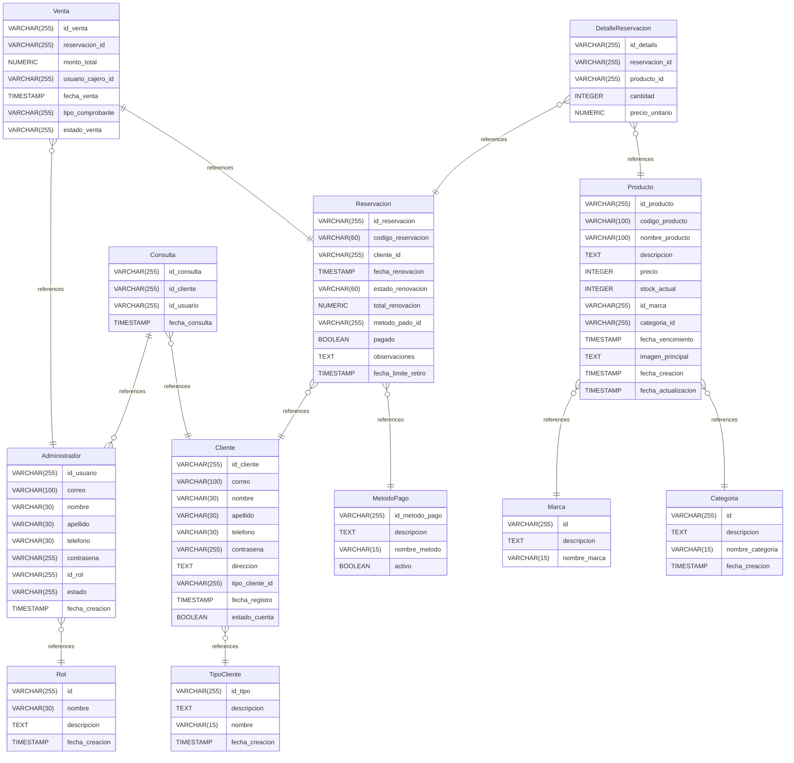

# P01DB documentation
## Summary

- [Introduction](#introduction)
- [Database Type](#database-type)
- [Table Structure](#table-structure)
	- [Rol](#rol)
	- [Marca](#marca)
	- [Categoria](#categoria)
	- [MetodoPago](#metodopago)
	- [TipoCliente](#tipocliente)
	- [Consulta](#consulta)
	- [DetalleReservacion](#detallereservacion)
	- [Venta](#venta)
	- [Cliente](#cliente)
	- [Administrador](#administrador)
	- [Reservacion](#reservacion)
	- [Producto](#producto)
- [Relationships](#relationships)
- [Database Diagram](#database-diagram)

## Introduction

## Database type

- **Database system:** PostgreSQL
## Table structure

### Rol

| Name        | Type          | Settings                      | References                    | Note                           |
|-------------|---------------|-------------------------------|-------------------------------|--------------------------------|
| **id** | VARCHAR(255) | 🔑 PK, not null, unique |  | |
| **nombre** | VARCHAR(30) | not null |  | |
| **descripcion** | TEXT | null |  | |
| **fecha_creacion** | TIMESTAMP | not null |  | | 

### Marca

| Name        | Type          | Settings                      | References                    | Note                           |
|-------------|---------------|-------------------------------|-------------------------------|--------------------------------|
| **id** | VARCHAR(255) | 🔑 PK, not null, unique |  | |
| **descripcion** | TEXT | null |  | |
| **nombre_marca** | VARCHAR(15) | not null |  | | 

### Categoria

| Name        | Type          | Settings                      | References                    | Note                           |
|-------------|---------------|-------------------------------|-------------------------------|--------------------------------|
| **id** | VARCHAR(255) | 🔑 PK, not null, unique |  | |
| **descripcion** | TEXT | null |  | |
| **nombre_categoria** | VARCHAR(15) | not null |  | |
| **fecha_creacion** | TIMESTAMP | null |  | | 

### MetodoPago

| Name        | Type          | Settings                      | References                    | Note                           |
|-------------|---------------|-------------------------------|-------------------------------|--------------------------------|
| **id_metodo_pago** | VARCHAR(255) | 🔑 PK, not null, unique |  | |
| **descripcion** | TEXT | null |  | |
| **nombre_metodo** | VARCHAR(15) | not null |  | |
| **activo** | BOOLEAN | not null |  | | 

### TipoCliente

| Name        | Type          | Settings                      | References                    | Note                           |
|-------------|---------------|-------------------------------|-------------------------------|--------------------------------|
| **id_tipo** | VARCHAR(255) | 🔑 PK, not null, unique |  | |
| **descripcion** | TEXT | null |  | |
| **nombre** | VARCHAR(15) | not null |  | |
| **fecha_creacion** | TIMESTAMP | not null |  | | 

### Consulta

| Name        | Type          | Settings                      | References                    | Note                           |
|-------------|---------------|-------------------------------|-------------------------------|--------------------------------|
| **id_consulta** | VARCHAR(255) | 🔑 PK, not null, unique |  | |
| **id_cliente** | VARCHAR(255) | not null | consulta | |
| **id_usuario** | VARCHAR(255) | not null | atiende | |
| **fecha_consulta** | TIMESTAMP | not null |  | | 

### DetalleReservacion

| Name        | Type          | Settings                      | References                    | Note                           |
|-------------|---------------|-------------------------------|-------------------------------|--------------------------------|
| **id_details** | VARCHAR(255) | 🔑 PK, not null, unique |  | |
| **reservacion_id** | VARCHAR(255) | not null | contiene | |
| **producto_id** | VARCHAR(255) | not null | contiene | |
| **cantidad** | INTEGER | not null |  | |
| **precio_unitario** | NUMERIC | not null |  | | 

### Venta

| Name        | Type          | Settings                      | References                    | Note                           |
|-------------|---------------|-------------------------------|-------------------------------|--------------------------------|
| **id_venta** | VARCHAR(255) | 🔑 PK, not null, unique |  | |
| **reservacion_id** | VARCHAR(255) | not null | realiza | |
| **monto_total** | NUMERIC | not null |  | |
| **usuario_cajero_id** | VARCHAR(255) | not null | atiende | |
| **fecha_venta** | TIMESTAMP | not null |  | |
| **tipo_comprobante** | VARCHAR(255) | not null |  | |
| **estado_venta** | VARCHAR(255) | not null |  | | 

### Cliente

| Name        | Type          | Settings                      | References                    | Note                           |
|-------------|---------------|-------------------------------|-------------------------------|--------------------------------|
| **id_cliente** | VARCHAR(255) | 🔑 PK, not null, unique |  | |
| **correo** | VARCHAR(100) | not null |  | |
| **nombre** | VARCHAR(30) | not null |  | |
| **apellido** | VARCHAR(30) | null |  | |
| **telefono** | VARCHAR(30) | null |  | |
| **contrasena** | VARCHAR(255) | not null |  | |
| **direccion** | TEXT | null |  | |
| **tipo_cliente_id** | VARCHAR(255) | not null | fk_Cliente_tipo_cliente_id_TipoCliente | |
| **fecha_registro** | TIMESTAMP | not null |  | |
| **estado_cuenta** | BOOLEAN | not null |  | | 

### Administrador

| Name        | Type          | Settings                      | References                    | Note                           |
|-------------|---------------|-------------------------------|-------------------------------|--------------------------------|
| **id_usuario** | VARCHAR(255) | 🔑 PK, not null, unique |  | |
| **correo** | VARCHAR(100) | not null |  | |
| **nombre** | VARCHAR(30) | not null |  | |
| **apellido** | VARCHAR(30) | null |  | |
| **telefono** | VARCHAR(30) | null |  | |
| **contrasena** | VARCHAR(255) | not null |  | |
| **id_rol** | VARCHAR(255) | not null | Pertenece | |
| **estado** | VARCHAR(255) | null |  | |
| **fecha_creacion** | TIMESTAMP | not null |  | | 

### Reservacion

| Name        | Type          | Settings                      | References                    | Note                           |
|-------------|---------------|-------------------------------|-------------------------------|--------------------------------|
| **id_reservacion** | VARCHAR(255) | 🔑 PK, not null, unique |  | |
| **codigo_reservacion** | VARCHAR(60) | not null |  | |
| **cliente_id** | VARCHAR(255) | not null | realiza | |
| **fecha_renovacion** | TIMESTAMP | not null |  | |
| **estado_renovacion** | VARCHAR(60) | null |  | |
| **total_renovacion** | NUMERIC | null |  | |
| **metodo_pado_id** | VARCHAR(255) | not null | utiliza | |
| **pagado** | BOOLEAN | not null |  | |
| **observaciones** | TEXT | null |  | |
| **fecha_limite_retiro** | TIMESTAMP | not null |  | | 

### Producto

| Name        | Type          | Settings                      | References                    | Note                           |
|-------------|---------------|-------------------------------|-------------------------------|--------------------------------|
| **id_producto** | VARCHAR(255) | 🔑 PK, not null, unique |  | |
| **codigo_producto** | VARCHAR(100) | not null |  | |
| **nombre_producto** | VARCHAR(100) | not null |  | |
| **descripcion** | TEXT | null |  | |
| **precio** | INTEGER | not null |  | |
| **stock_actual** | INTEGER | not null |  | |
| **id_marca** | VARCHAR(255) | not null | pertenece | |
| **categoria_id** | VARCHAR(255) | not null | pertenece | |
| **fecha_vencimiento** | TIMESTAMP | not null |  | |
| **imagen_principal** | TEXT | null |  | |
| **fecha_creacion** | TIMESTAMP | not null |  | |
| **fecha_actualizacion** | TIMESTAMP | not null |  | | 

## Relationships

- **Administrador to Rol**: many_to_one
- **Venta to Administrador**: many_to_one
- **Consulta to Administrador**: one_to_many
- **Venta to Reservacion**: one_to_one
- **DetalleReservacion to Producto**: many_to_one
- **DetalleReservacion to Reservacion**: many_to_one
- **Consulta to Cliente**: many_to_one
- **Reservacion to Cliente**: many_to_one
- **Reservacion to MetodoPago**: many_to_one
- **Producto to Marca**: many_to_one
- **Producto to Categoria**: many_to_one
- **Cliente to TipoCliente**: many_to_one

## Database Diagram

